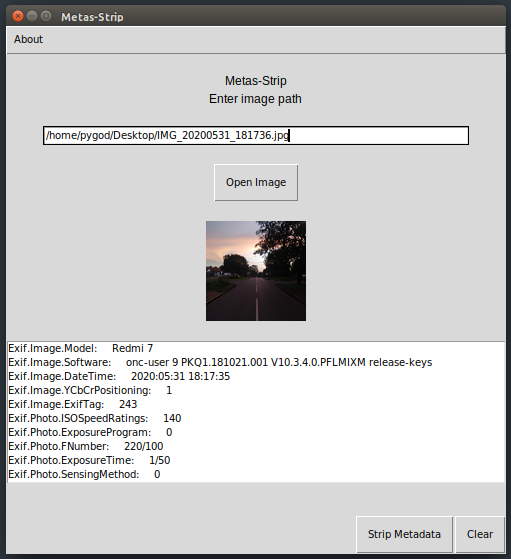
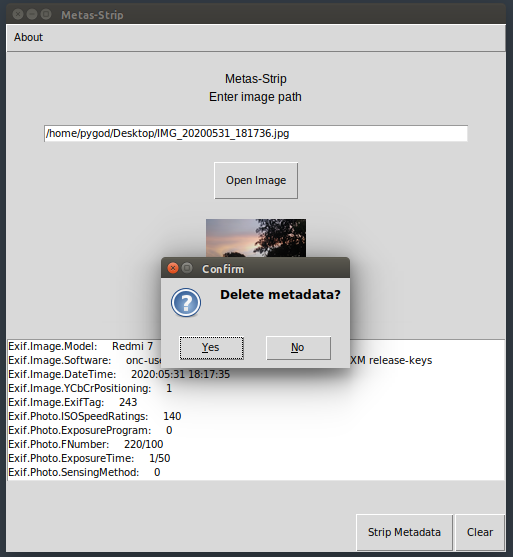
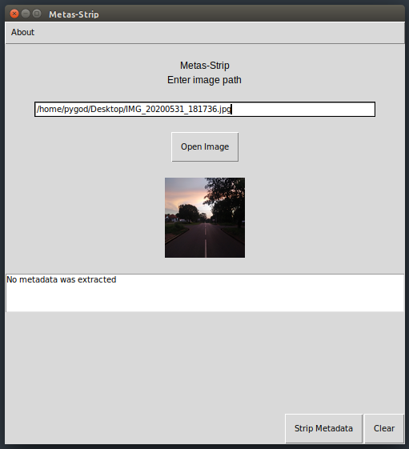

# metas-strip
Strip metadata from images

This is a simple GUI based program which is used to delete all metadata contained in an image file
As of now, it will only work on Linux (Ubuntu) based systems because of some dependencies only in linux

 - Loading an image

- You can see all the metadata which has been read from the image, like phone model, date, etc.

Deleting metadata

- After

- After wiping, the metadata no longer exists

Requirements
guizero
tkinter
PIL
pyexiv2

# Steps to install pyexiv2 for Ubuntu users
- `sudo apt-get install build-essential`
- `sudo apt-get install python-all-dev`
- `sudo apt-get install libexiv2-dev`
- `sudo apt-get install libboost-python-dev`
- `pip3 install py3exiv2`

# Changelog
- Version 0.0.1 : Working, no Mac or Windows compat